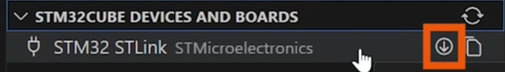
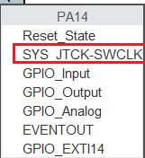
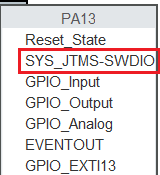
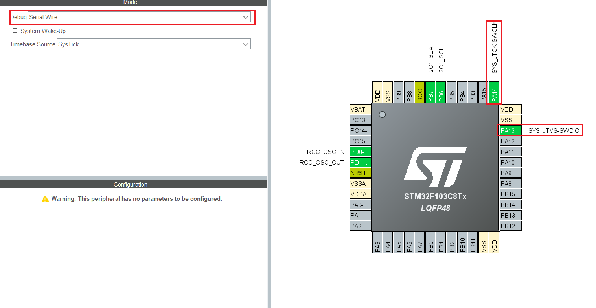

### 问题及解决方案
#### stlink固件版本过低
特征: 无法烧录,报错信息含有以下文本
```
Error in initializing ST-LINK device.

Reason: ST-LINK firmware upgrade required. Please upgrade the ST-LINK firmware using the upgrade tool.
```

解决方法
使用插件中的升级功能升级stlink的固件

升级前后需拔插stlink

#### 芯片被锁
特征: 无法烧录出现
```
No Device Found
```

解决方法见
https://keysking.com/docs/stm32/FAQ/CompilationFailed

原因解释
前置信息1 SWD烧录:
- 通过stlink 进行SWD烧录程序时,需要使用芯片的两个引脚,需要这两个引脚配置为SYS_JTCK-SWCLK和SYS_JTCK-SWDIO
- 这两个引脚的模式是可以用户配置的
- 芯片中有两个引脚默认使用的是这个模式(默认指的是出厂之后,上电之后和按完reset后)


- 在选择debug mode为No
Debug之后,会关闭两个引脚默认的SYS_JTCK-SWCLK和SYS_JTCK-SWDIO模式

关闭的代码的调用栈是
```
main
HAL_MspInit
__HAL_AFIO_REMAP_SWJ_DISABLE
```
- 在选择debug mode为Serail Wire之后,会配置两个引脚为SYS_JTCK-SWCLK和SYS_JTCK-SWDIO

配置代码的调用栈是
```
main
HAL_MspInit
__HAL_AFIO_REMAP_SWJ_NOJTAG()
```
(原本就已经是SYS_JTCK-SWCLK和SYS_JTCK-SWDIO模式了,重新配置一次相当于没变)

前置信息2 BOOT:
- stm32上有两个引脚分别是BOOT0和BOOT1,它们不能被用户配置为其他功能所以在cubemx中看不到它们
- 它们负责改变芯片在上电或者按完reset后执行什么程序
- 规则如下

| BOOT0  | BOOT1  | 运行代码的区域 |        解释        |
| :----: | :----: | :------------: | :----------------: |
| 低电平 | 低电平 |    主 Flash    |    运行用户程序    |
| 低电平 | 高电平 |      同上      |        同上        |
| 高电平 | 低电平 |   系统存储区   | 运行出场自带的程序 |
| 高电平 | 高电平 |      SRAM      |      几乎没用      |

- 运行出场自带的程序是不可被用户编辑的是写死的
- 运行出场自带的程序有一些功能(但和这个问题没有关系,不详细说)

有了上面的信息就可以解释发生了上面,可以先不看下面的解释,自己琢磨一下
情况一:
- 新板子(或者能正常使用的板子)烧录`debug mode`为`No debug`的程序两次
- 第一次可以烧录,因为一开始板子的两个引脚是SYS_JTCK-SWCLK和SYS_JTCK-SWDIO模式
- 第二次不能烧录,因为第一次烧录之后并运行之后,板子的两个引脚的SYS_JTCK-SWCLK和SYS_JTCK-SWDIO被关闭了
- 此时按下reset,引脚短暂变为SYS_JTCK-SWCLK和SYS_JTCK-SWDIO然后立刻被关闭

情况一:
- 在发生了情况一后,执行 改BOOT -> reset -> 烧录`debug mode`为`Serial Wire`的程序 ->改BOOT -> reset
- 改BOOT + reset 后芯片执行了出厂默认程序,这个程序没有将引脚的SYS_JTCK-SWCLK和SYS_JTCK-SWDIO关闭
- 所以可以正常烧录
- 之后将BOOT改回来 + reset 芯片就会执行用户的代码了,并且用户正确配置了引脚的SYS_JTCK-SWCLK和SYS_JTCK-SWDIO所以以后也可以正常烧录
